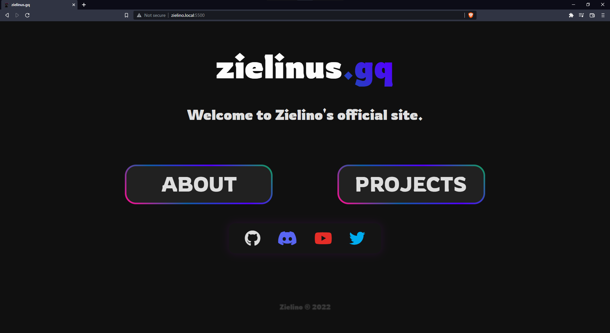
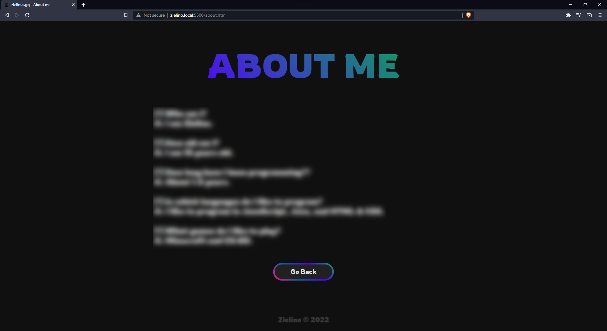
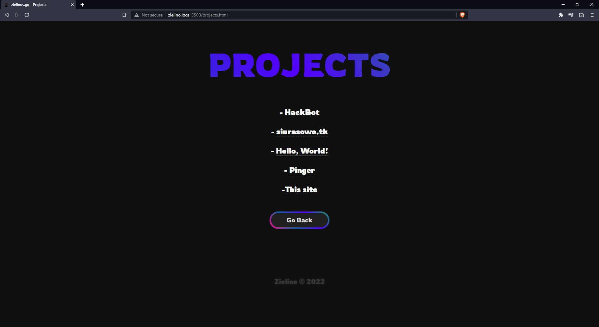
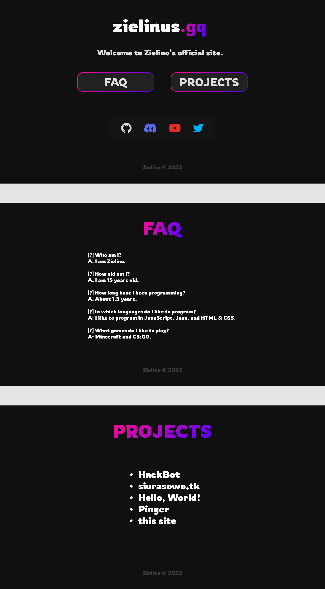

# zielinus.gq

I recoded my website in 2.5h

I think it looks better now

### See it [here](https://www.zielinus.gq/)

## Old website src

Branch of old website in this repository [here](https://github.com/Zielin0/zielinus.gq/tree/old)
Archived repository of older website [here](https://github.com/Zielin0/zielino-web)

## License

This project is under the [MIT](./LICENSE) license

## Gallery

### Main page

### About page

### Projects page

### Figma project

